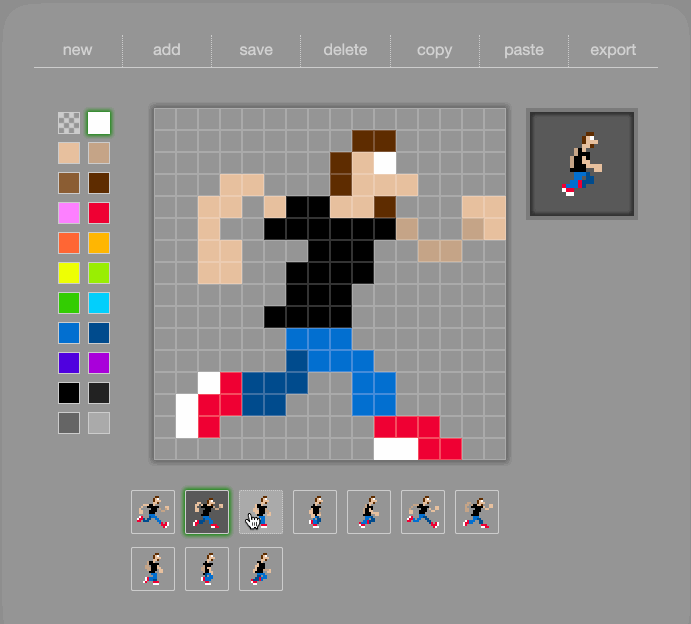

# CSS Sprite Animator

CSS `box-shadow` pixel animation editor using React 16, state/context. You can edit, design and create pixel animations, then export the json array out. I created this tool to model animations for Arduino/LED matrix displays and other hardware proejcts. Vars in the Store.js can allow you to change dimensions, pixel size and color palettes used. (some sizes are also in CSS vars too - I know weird but working on it...)

Because of the limitations of Arduino I kept each frame as an 1D array, with each pixel saved as an _(x/y/color)_ object. That data is then turned into an inline CSS style which is applied to a DIV or other DOM element, or any other program you want. It's just a 2D coordinate and hex color.

_example of a frame of animation_

```css
inlineStyle = {
  box-shadow: #e7c09d 40px 8px 0px, #e7c09d 48px 8px 0px, #e7c09d 40px 16px 0px,
    #e7c09d 48px 16px 0px, #e7c09d 32px 24px 0px, #e7c09d 40px 24px 0px,
    #ee0033 32px 32px 0px, #ee0033 40px 32px 0px, #ee0033 32px 40px 0px, #ee0033
      40px 40px 0px, #0033ff 32px 48px 0px, #0033ff 40px 48px 0px,
    #999999 24px 56px 0px, #0033ff 32px 56px 0px, #0033ff 40px 56px 0px, #0033ff
      32px 64px 0px, #999999 40px 64px 0px;
  background: transparent;
  margin: -8px 8px 8px -8px;
  width: 8px;
  height: 8px;
}
```

## Use

Click anywhere on the grid to add a color, click again to erase or use a new color. You can also add a new frame, delete, copy and paste. The animation will start to play as soon as a second frame is created. Click 'NEW' to start fresh!

##### Keyboard Shortcuts

- [arrow keys] position on grid
- [n]ew frame
- [c]opy frame
- [v] paste frame

## Features

- Save, Copy, Detele, Paste frames to create timeline animation.
- Generates box-shadow CSS and animates them using an array.
- React/CSS based, easily modify grid, display and component size.

## Run the example

Requires Node v12.18.3 or greater.

```bash
$ npm install
$ npm start
```

open http://localhost:2020

### Set-up of Application

The set up is pretty simple, index.js loads ``SpriteAnimator.js` in Components, which loads other UI components.

`src/index.js --> components/SpriteAnimator.js`

I tried to break out the UI from the main framework to make it easier to play with the UX of and editor like this. Future plans include saving to db and export to gif.

More to come as this is a work in progress.
